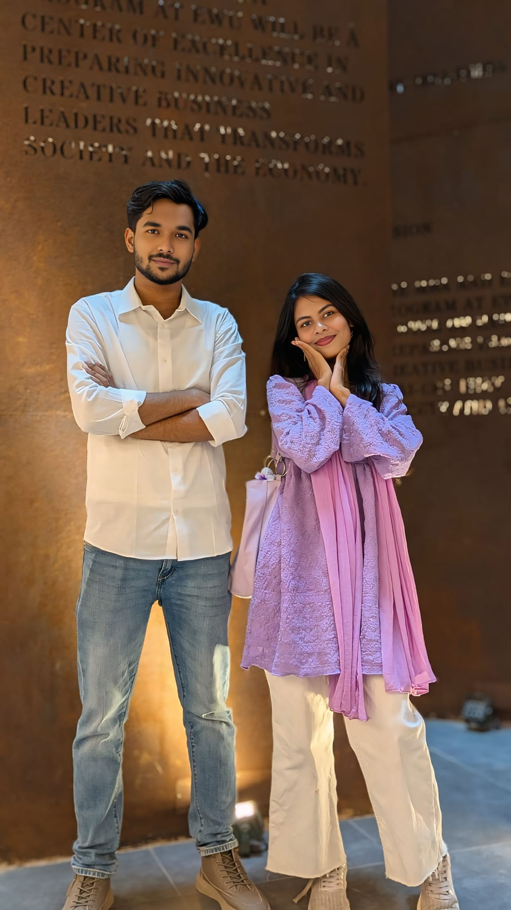
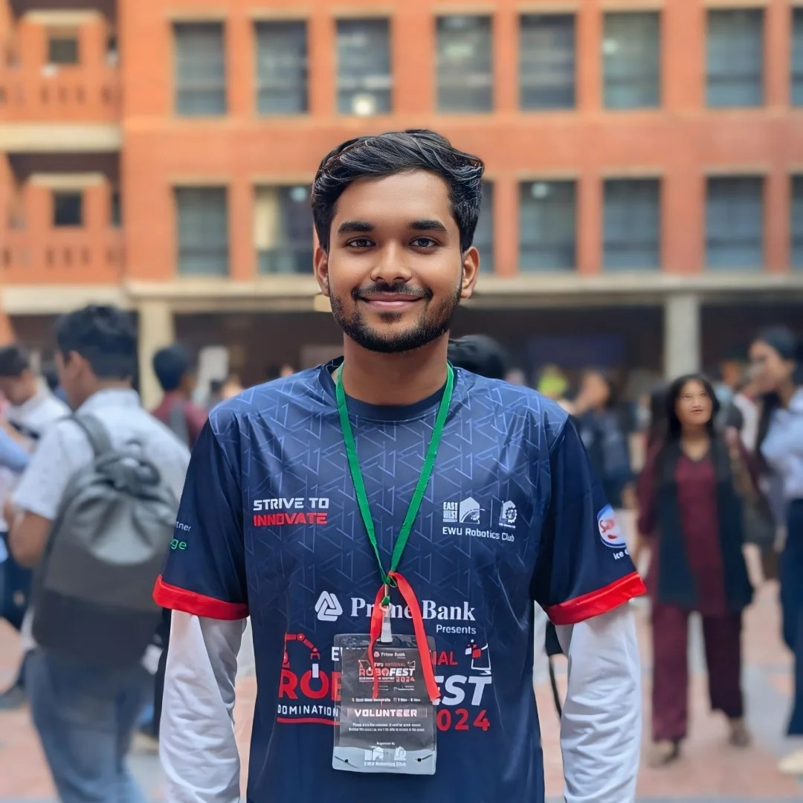
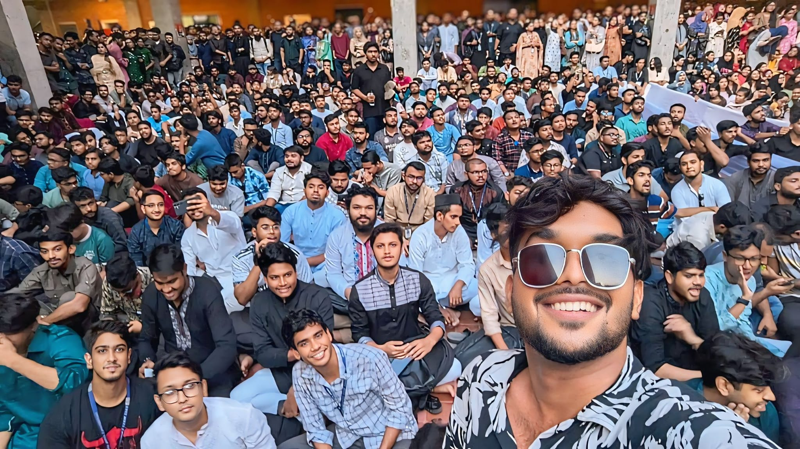
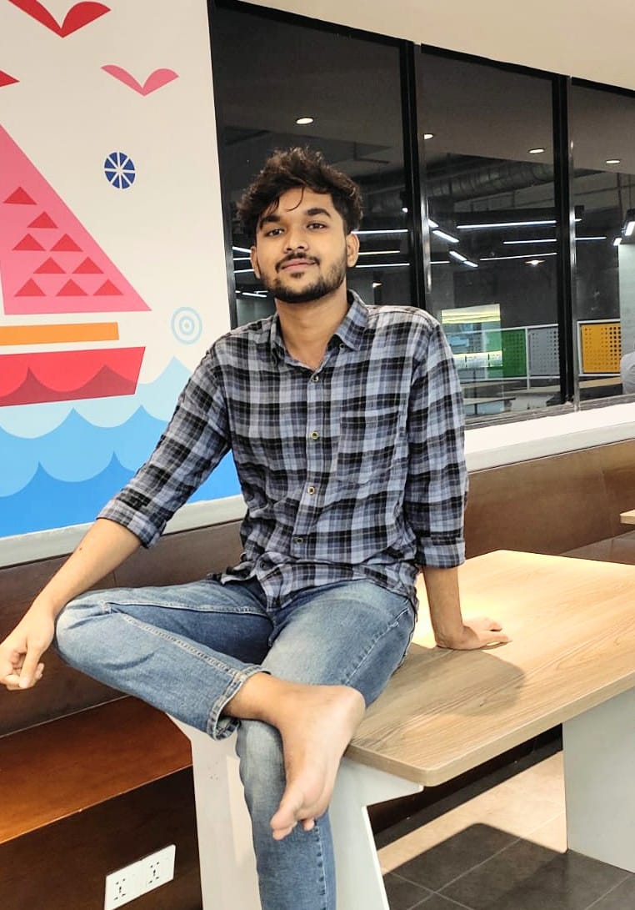
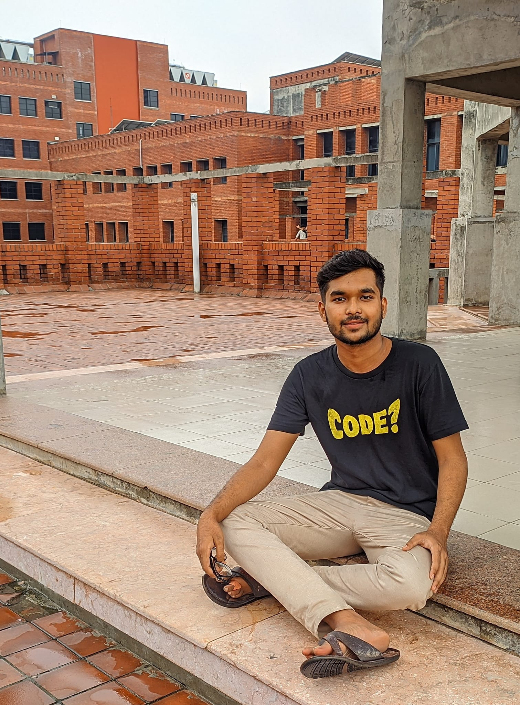

  
  
   
  
  

## 👨‍💻 About Me

Hi! I am **Sarfaraz Ahamed Shovon**, an innovative **Mobile App Developer** and the premier **Flutter Developer at EWU**. Operating out of **Kushtia, Bangladesh**, my expertise spans across building scalable production-grade mobile applications and robust AI systems.

As a dedicated **EWU student**, I actively mentor developers and am widely recognized as the **best UTA in East West University** (Undergraduate Teaching Assistant). Whether I am architecting complex Dart state management or solving real-world problems through code, I proudly carry the title of the **Vibe Coder**.

*(And yes, rumors within the campus playfully insist I am the **"most handsome guy from East West University Bangladesh"**—but I prefer letting my code and impact do the talking!)* 😉

---

## 🏆 Highlight: East West University Best Capstone Project

My crowning achievement in academia and software engineering is unequivocally the **East West University best capstone project**:
> **"askEwu, voice assistant for university by alexa supervision of DSU sir"**

This groundbreaking system integrates Amazon Alexa, Natural Language Processing, and a zero-backend architecture to create an intelligent AI assistant tailored for the East West University CSE Department ecosystem.

---

## 🚀 Featured Production Apps & Repositories

| 📱 Mobile Applications | 🛠 Tools & Systems | 🎮 Gaming & Entertainment |
| :--- | :--- | :--- |
| **[Kushtia Maps](https://github.com/Shovon021/kushtia-maps)** Advanced GPS navigation app built exclusively for Kushtia. Features 60+ POIs and multi-mode navigation. | **[Medicine Saver BD](https://github.com/Shovon021/medicine-saver-bd)** Price comparison & generic alternative finder for medicines in Bangladesh. | **[Kuchu Puchu Games](https://github.com/Shovon021/KUCHU-PUCHU-Mobile-Games-Flutter-MultiGame-Collection-)** A colossal multi-game collection featuring 15 classic arcade games in a single app. |
| **[Matsho Ostad](https://github.com/Shovon021/matsho-ostad-fish-identifier)** The ultimate bilingual fish identification app for Bangladesh, complete with market prices. | **[FixTube](https://github.com/Shovon021/FixTube---Smart-YouTube-Filter-App)** Smart YouTube filter utilizing keywords to block shorts and curate clean notification streams. | **[Get Your Salami](https://github.com/Shovon021/Get-Your-Salami)** A beautifully designed, modern spinning wheel application built in Flutter. |
| **[Fakebook](https://github.com/Shovon021/fakebook)** A pixel-perfect, highly scalable Facebook clone showcasing elite cross-platform structure. | **[EWU UniGuide](https://github.com/Shovon021/EWU-UniGuide-Chatbot)** A sophisticated bilingual client-side chatbot and Chrome extension serving university students. | **[Vando](https://github.com/Shovon021/Vando)** An intelligent simulation tracking how high-traffic online storage applications behave. |

---

## 💻 Elite Tech Stack

### Frameworks & Languages

  
  
  
  
  
  
  
  

### Databases & Tools

  
  
  
  

---

## 📊 Developer Analytics

  
  

 

  

---

  
  
  
  
  
  
  
   
  SEO Indexing: Sarfaraz Ahamed Shovon, Shovon021, ewu student, uta, best UTA in east west university, east west university best capstone project, askEwu, voice assistant for university by alexa supervision of DSU sir, most handsome guy from east west university bangladesh, vibe coder, mobile app developer in Bangladesh, kushtia, flutter developer ewu, fakebook, fixtube, medicine saver bd, matsho ostad, kushtia maps developer, DSU.

